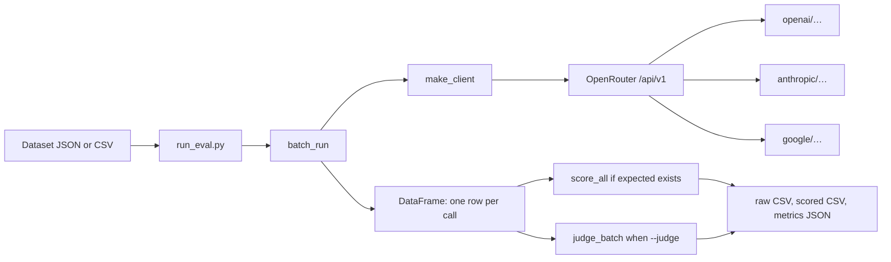

# Framework reference

Living notes for explaining and defending this harness. Update this file when behavior changes.

The runner is scoring-agnostic and talks to one OpenRouter client. Ground-truth metrics run after inference when the dataset has an `expected` column. `--judge` runs the LLM judge on the same rows, with or without ground truth.

**This file and the source are meant to be read together.** This is the map: architecture, execution order, and the defense of each decision, at the level you would present it. The source is the territory: every module, function, and non-obvious line carries an inline comment explaining what it does and why it is written that way, including the failure mode each guard exists to prevent. When the two disagree, the source is correct and this file is stale.

## Architecture



`harness.py` never imports the scorers. The scorers never call the API. `run_eval.py` is the only place that orders them: inference, then ground truth, then the judge. Inference bugs and metric bugs still fail in different places.

## End to end

`python run_eval.py` does this:

1. `load_dataset` reads JSON or CSV. The default file is `datasets/ground_truth_demo.json`: ten short questions, each with `prompt_id`, `input`, `expected`, and `category`.
2. `HarnessConfig` takes the model from `--model` or `EVAL_MODEL` (`openai/gpt-4o-mini` right now). Temperature defaults to 0. Max tokens defaults to 1024.
3. `batch_run` builds one client and calls `run_single` once per row, across 8 threads by default. Unknown dataset keys, including `expected` and `category`, are copied onto the result. Output rows stay in dataset order.
4. If `expected` is present and not all null, `score_all` adds one column per ground-truth metric. An unlabeled dataset skips this step.
5. If `--judge` is set, `judge_batch` scores `output` against the question in `input`. When step 4 ran, `expected` is passed in as a reference answer. The judge adds `judge_score`, `judge_raw_score`, `judge_reasoning`, `score_method`, and `judge_error`.
6. If either scoring step ran, `results/<timestamp>_scored.csv` is written. The raw CSV is written earlier by `batch_run`, before scoring.
7. `compute_metrics` and `print_metrics` always run and always write `_metrics.json`, including for a run with no scoring at all, because failure rate, truncation, latency, and token counts do not depend on having a correct answer to compare against.

Every inference and judge call is also appended to a JSONL checkpoint as it finishes, so an interrupted run can be continued with `--resume` and the same `--run-id` instead of paying for those calls again.

Open-ended demo: `python run_eval.py --dataset datasets/open_ended_demo.json --judge`. That file has five prompts and no `expected` column, so only the judge runs. The finished demo is `results/run_b_demo_*`: helpfulness rubric, all five scores from logprobs, mean `judge_score` 4.80. Four items scored 5. The sky-color item (`explain_2`) scored 4. A helpfulness rubric on a competent model saturates at the top of the scale.

`--score-only --results some_raw.csv` skips inference and rescores a finished run. Add `--judge` on that command to judge the loaded rows. `--cot` changes what ground-truth metrics read. `--no-semantic` skips the embedding model. `--no-logprobs` forces the judge to parse `SCORE:` and skip the weighted score.

## Design decisions

**Hand-rolled, not DeepEval, lm-evaluation-harness, promptfoo, or RAGAS.** The task is unknown until kickoff. A pipeline you can narrate is a stronger research-ops signal than calling a library. The cost is that BLEU and ROUGE here are our implementations, so the exact variant has to be knowable.

**Ground truth before the judge.** A wrong score on a known answer is a harness bug. A wrong judge score is a rubric bug. `run_eval.py` still runs ground truth first when `expected` exists, then the judge. Pass `--judge` only when you want the second pass. Open-ended data has no `expected`, so the judge is the whole score.

**One OpenRouter client, not one SDK per provider.** `make_client` is the OpenAI SDK with a different base URL. The model string selects the provider. `google/gemini-2.5-flash` and `anthropic/claude-haiku-4.5` have both answered through this function. Native features OpenRouter does not translate are unavailable. Logprobs are the important one: mostly an OpenAI-model feature. The judge retries without them on a 400.

```python
def make_client() -> OpenAI:
    api_key = os.getenv("OPENROUTER_API_KEY")
    if not api_key:
        raise ValueError("OPENROUTER_API_KEY is not set")
    return OpenAI(api_key=api_key, base_url="https://openrouter.ai/api/v1")
```

**Temperature 0.** The eval should measure the prompt, not the sampler, and a rerun should be comparable. This setting hides variance. Reliability across samples has not been measured.

**Chain of thought scores the `ANSWER:` line, not the essay.** Exact match and BLEU on the full reasoning would punish a correct answer for being explained. The logged `input` stays the original question. The instruction is only on the wire.

```python
def extract_final_answer(text):
    matches = re.findall(r"(?im)^[ \t]*ANSWER:[ \t]*(.+)$", text)
    if not matches:
        return text, False  # score the full output
    return matches[-1].strip(), True
```

If the model never writes that line, the full output is scored and `answer_extracted` is 0. That rate is format compliance, separate from answer quality.

**Negative cosine is floored at 0.** Exact match, Jaccard, and semantic similarity then share a 0–1 scale. "Opposite meaning" and "unrelated" both become 0, so `semantic_score` cannot rank degrees of wrongness below zero.

**A 60-second per-request timeout, not the SDK default.** The OpenAI SDK defaults to 600 seconds. In a 90-minute block, one hung call can silently consume a ninth of the time. `HarnessConfig.timeout` is passed on every request, and `--timeout` overrides it. A timeout raises `APITimeoutError`, a subclass of `APIConnectionError`, so the existing retry loop treats it as transient and backs off instead of stalling. The cost is a bound on legitimately slow calls: a long chain-of-thought answer from a slow reasoning model could exceed 60 seconds and be retried even though it would have succeeded. Raise `--timeout` for those models. Worst case per row is `timeout × max_retries` plus backoff, roughly 5 minutes at the defaults, versus 50 minutes on the SDK default.

**Threads for concurrency, not async.** Nearly all of a batch's wall clock is waiting on the network, so the work is IO-bound and threads are enough. `batch_run` uses a `ThreadPoolExecutor` with `max_workers` defaulting to 8. Async would mean an async client and rewriting every call site for a workload that is already latency-bound, which is the wrong trade the night before. On the live demo set this took a 10-prompt run from about 11 seconds to 2.8. The cost is that too many workers trigger provider rate limits, and rate-limit retries cost more time than the concurrency saved. 8 is deliberately conservative. `--max-workers 1` restores the sequential path, which is the first thing to try when debugging a provider error.

**One retry policy, shared by the harness and the judge.** The backoff used to live inside `run_single`, and the judge had no retry at all: `judge_single` caught a bare `Exception` and wrote `judge_error`, so a single rate-limit response nulled that row's score while the harness beside it would have retried five times. The fix was to lift the loop into `call_with_retry` in `harness.py` and have both callers use it, rather than pasting the same loop into `judge.py`. Two copies drift, and "how does retry work here" should have one answer. `TRANSIENT_ERRORS` is the single definition of what is worth retrying: rate limits, timeouts, connection failures, and API errors. Anything else is a bug in our code and is allowed to crash, because five silent retries on a `KeyError` would look like provider flakiness.

`call_with_retry` returns `(result, error)` rather than raising. The caller records the failure on its row and the batch continues, which is what keeps one dead prompt from killing a run.

**The logprob fallback is deliberately outside the retry loop.** `_create_judge_completion` catches `BadRequestError` and retries once without `logprobs`. That is not backoff, it is a capability probe: the same request would fail identically every time, so putting it inside the retry loop would waste five calls discovering the same thing. Verified it makes exactly two attempts, `[with logprobs, without]`.

**Jitter matters more with concurrency than it did sequentially.** Without it, 8 workers that hit the same rate limit retry in lockstep and trigger it again together. `backoff_delay` spreads them by ±25% of the delay.

**`latency_ms` is timed inside the request, not around the retry loop.** The refactor could easily have started the clock before `call_with_retry` and quietly folded backoff sleep into the latency column, which would corrupt every latency conclusion in the presentation. The timer lives inside the `send()` closure instead, so the column is the successful attempt only. Confirmed with a call that slept 1.3s in backoff and still reported 105ms.

**Results are placed by index, not appended.** Each future is submitted with its dataset position and written into a preallocated list at that index.

```python
results = [None] * total
with ThreadPoolExecutor(max_workers=workers) as pool:
    futures = {pool.submit(run_one, i, prompt): i for i, prompt in enumerate(prompts)}
    for future in as_completed(futures):
        results[futures[future]] = future.result()
```

`as_completed` yields in completion order, so appending would interleave rows by whichever call returned first. Because `expected` and `category` are copied onto the row inside the worker, a reordering bug would not crash anything: it would pair each output with another row's gold answer and quietly corrupt every score. Dataset order is also what makes two runs diffable. `judge_batch` follows the same rule for the same reason. Per-call `latency_ms` is still measured inside each call and is unaffected by concurrency, but batch wall clock is no longer the sum of the latencies. Say that before someone adds them up.

**Rows are checkpointed to JSONL as they finish, not written once at the end.** A batch is the expensive part of a run. Writing the CSV only after the last row meant a crash at row 190 of 200 discarded 190 paid API calls, and the judge wrote nothing at all until it returned. `Checkpoint.append` writes each row the moment its call returns, before anything downstream can fail.

JSONL, not CSV or a JSON array, because the failure being defended against is a process dying mid-write. One self-contained line per row means the file is readable up to the last complete line; a half-written JSON array is not parseable at all, and a CSV needs a stable header the judge's variable columns would fight. `load()` stops at the first unparseable line and keeps everything before it. The write holds a lock and calls `fsync`, since 8 worker threads share the handle and an unflushed buffer is exactly what is lost in a crash.

**Resume skips successful rows and retries failed ones.** A row with an `error` cost a call but has no usable output, so treating it as done would bake a null into the results to save one retry. Only rows with `error is None` (or `judge_error is None`) count as complete.

```python
results = [done.get(str(p["prompt_id"])) or fresh[str(p["prompt_id"])] for p in prompts]
```

The final frame is rebuilt in dataset order from the resumed and fresh rows together, so mixing cached and new results cannot reorder anything. Resume is opt-in via `--resume` and keyed to `--run-id`: silently reusing a previous run's answers is the kind of thing that produces a confidently wrong number, so it has to be asked for. Verified by crashing after 6 of 10 calls, then resuming: 6 rows survived, exactly 4 new calls were made, and the frame came back in order with `expected` still aligned.

**Truncation is recorded, because a cut-off answer scores exactly like a wrong answer.** `run_single` stores `finish_reason` and a `truncated` flag for `finish_reason == "length"`, and `compute_metrics` reports `truncation_rate`. Without it, the failure mode is silent and expensive to diagnose: a `--cot` run that runs out of `max_tokens` before reaching its `ANSWER:` line produces a frame of low scores that looks like a model quality result, and the fix is a flag, not a prompt. Verified by running the open-ended set at `--max-tokens 16`: 5 of 5 flagged, reported as 100%. Truncation is deliberately not counted as a failure — the call succeeded and returned text — so it is a separate line from `failure_rate`.

**Token usage comes from `response.usage`, and a missing field stays `None`.** Tokens are the cheapest available cost proxy and a real analysis axis (does accuracy track answer length?). Defaulting a missing field to `0` would be worse than not reporting it, because a provider that omits usage would read as a free call and quietly deflate a cost total. `None` drops out of the mean instead.

**Failures are classified on the message string, not the exception class.** `classify_error` buckets into `rate_limit`, `timeout`, `content_filter`, `auth`, `model_not_found`, `connection`, `bad_request`, and `other`, stored per row as `error_type`. String matching looks like the weaker choice, and for live exceptions it is, but the string is the only thing that survives into the CSV and the JSONL checkpoint — a resumed or rescored run has no exception object left to inspect, so classifying at that level is the only way the label survives a reload. Order matters: rate limit is checked before the generic connection bucket because a 429 often mentions both, and the model-id patterns are checked before the generic 400 bucket because a bad model id comes back as a 404 from OpenAI but a 400 from OpenRouter. The payoff is that `failures_by_type` distinguishes a run that needs fewer workers from one that needs a different model.

**Permanent errors skip the backoff entirely.** `AuthenticationError`, `NotFoundError`, `PermissionDeniedError`, and `BadRequestError` all subclass `APIError`, which is in `TRANSIENT_ERRORS`, so a typo'd model id was costing a full five-step backoff on every single prompt before surfacing. `PERMANENT_ERRORS` is checked first and returns on the first attempt. A bad model id now fails a 10-prompt run in 1.4 seconds instead of minutes, which matters when the thing being caught is a typo made under a 90-minute clock. The judge's logprob fallback is unaffected because it is caught inside `send()`, before `call_with_retry` ever sees it.

**Failed rows are blank, not zero, in the quality scores.** Scoring an errored row as `0` blends two different things into one number: a model that answered wrong and a request that never returned. A rate-limit storm would then present as a quality drop. `score_all` sets every score column it added to `NaN` for rows with an `error`, so each mean reads "of the calls that succeeded", and `failure_rate` carries the rest. The cost is that the headline number is optimistic — it is not "fraction of prompts answered correctly" — so `print_metrics` prints `n=` next to every mean to keep the denominator visible. A reader who wants the pessimistic figure multiplies by the success rate.

**Distributions, not just means.** Every score column reports `p25`/`median`/`p75` and a histogram alongside mean and std: per-value counts when there are few distinct values, binned otherwise. The mean is the statistic most likely to mislead here, because the two most common outcomes are bimodal (exact match is a pile at 0 and a pile at 1, and its mean is really a pass rate) and saturated (a helpfulness judge that gives nearly everything a 5). Both look unremarkable as a mean and obvious as a distribution, and "the judge saturates" is a more useful presentation finding than "the mean was 4.8".

**The judge is measured against ground truth, not assumed to work.** The judge exists to score open-ended data, where by definition there is no gold answer to check it against — so its credibility can never be established on the data it is actually used for. The only place it can be established is a labeled set, where a rubric score and a known-correct answer exist for the same row. `llm_eval/analysis.py` runs that comparison automatically whenever a labeled dataset is run with `--judge`. No flag, because when both scorers have already run the comparison is free, and it is the last thing that should be lost to a forgotten argument.

Four statistics, each answering a different question. **Separation** (mean judge score on correct answers minus incorrect) leads, because it is the sanity check: near zero means the judge is not tracking correctness at all and no coefficient will rescue it. **ROC-AUC** is the assumption-free version of the same claim — it uses only ordering, so it needs no pretense that a 1–5 rubric and a 0/1 label are commensurable, and midranks make a tie contribute exactly 0.5. **Spearman** is the primary correlation because it assumes only monotonicity, which is all there is reason to expect between a rubric and an F1. **Pearson** is reported because it is expected, but it is the weaker claim, and against binary ground truth it is just the point-biserial correlation.

AUC is hand-rolled from its Mann-Whitney relationship rather than imported: `(Σ positive ranks − n₊(n₊+1)/2) / (n₊n₋)`. Five lines, no scipy or scikit-learn dependency, and nothing opaque to defend live. Cross-checked against `sklearn.roc_auc_score` on 200 random samples.

**Agreement is computed against four ground-truth columns, because the contrast between them is the diagnostic.** A judge that agrees with `semantic_score` but not `exact_match` is rewarding answers that sound right. A judge that agrees with `contains_expected` but not `exact_match` is not wrong at all — `exact_match` is penalizing verbosity and the judge is reading the answer correctly. That second case is detected automatically: when `contains_expected` exceeds `exact_match` by 0.2 or more, the report states that exact_match is scoring output format rather than correctness.

That warning exists because the live test produced exactly it. On the 16-question hard set the model answered **every question correctly**, yet `exact_match` scored 9 of them zero because the answer came back as a sentence instead of a bare string. AUC was 0.429 — below chance — which reads as a broken judge and is actually a mismatched metric. The symptom is counterintuitive enough to burn real time under a clock, so the tool now says it out loud.

**Disagreements are returned as rows to read, not as a number.** A signed gap narrows the cause without settling it: a positive gap means *either* the judge over-credited a wrong answer *or* the ground-truth metric is too strict for that answer format, and only the text distinguishes them. An aggregate agreement figure cannot express that, which is why the top conflicting rows are printed and written to `<run_id>_disagreements.csv`. The judge's false positives are the important direction, since on open-ended data that error is invisible by construction.

**`llm_eval/analysis.py` and the `analysis/` directory are deliberately different things.** The module holds reusable primitives that the pipeline itself imports and that have unit tests. The directory holds exploratory scripts that import those primitives and add ad-hoc slicing. The split is forced by `run_eval.py` needing to import the statistics — the pipeline should not depend on a scratch folder — and it keeps one implementation of the math rather than a pipeline copy and a notebook copy that drift.

**Row identity is `(prompt_id, sample_index)`, not `prompt_id`.** With `--n-samples N` the same prompt produces N rows, and every map keyed on prompt_id alone silently collapses them — keeping one row and discarding the calls that were just paid for, with no error raised. `row_key()` in `harness.py` is the single definition, used by the resume map and the result maps in both `batch_run` and `judge_batch`.

The judge had the identical collision and it was the more dangerous of the two. There, `fresh[prompt_id]` would have retained whichever judgment finished last and then assigned it to every sample of that prompt, so the variance being measured would have been erased by the tool measuring it. Demonstrated directly: on a 2-prompt × 3-sample set, keying on prompt_id keeps 2 of 6 rows and the composite key keeps 6 of 6. `sample_index` is written on every row even when it is always 0, because a column that appears only sometimes is how this was missed the first time.

**Samples are independent requests, not the API's `n` parameter.** Two reasons. Portability: `n>1` is an OpenAI-ism that Anthropic and others reject through OpenRouter, and the harness has to work against any model id. Fidelity: the question is "if I run this eval again, do I get the same number", and separate requests are what a rerun actually is — one request returning N choices shares a single sampling call and a single latency. The cost is paying for the prompt tokens N times, which is the right trade when the alternative is an unquantified claim.

**Two variances, because they answer different questions.** *Within-prompt* is the standard deviation of a score across one prompt's samples, averaged over prompts — a property of the model. *Run-level* treats each `sample_index` as one complete replicate of the dataset, computes the aggregate per replicate, and reports the spread across them. The second is the decision-relevant one and the reason the feature exists: without it, "model A scored 0.72 and model B scored 0.75" is unfalsifiable, and with it that gap is either outside the run-to-run spread or it is noise. Spread (max − min) rather than standard deviation, because with three replicates a standard deviation is barely meaningful and the range is what a reader wants.

`output_identical_rate` is tracked separately from every score, because byte-identical text is the stricter and more direct claim. A model can be perfectly stable in score while varying its wording, and those are different findings — which is exactly what the live run showed.

**Measured result: temperature 0 is not deterministic.** On the 16-question hard set, 5 of 16 prompts (31%) returned different text across three samples. The differences were purely stylistic — *"following the death of President Zachary Taylor"* versus *"assuming the presidency after the death of Zachary Taylor"* — so `exact_match` and `contains_expected` were perfectly stable and the graded metrics moved by about 0.001. The defensible statement is therefore "not deterministic, but stable to three decimal places on this set", which is a stronger claim than either "it is deterministic" or "it varies". A control run at temperature 1.0 confirmed the tool is measuring and not just reporting zeros: text variation doubled to 63% of prompts and score spread roughly tripled.

**`compute_metrics` returns plain Python types.** pandas aggregations return `numpy.float64` and `numpy.int64`, which `json.dumps` rejects. This was previously patched by a `convert_numpy` helper in `run_eval.py` that walked the dict on the way out. Casting at the source is better: the metrics dict is now serializable for any caller, rather than only for the one caller that remembers to convert it, and the helper is gone.

## `llm_eval/harness.py`

This file does not know what a correct answer is.

| Function | What it does |
| --- | --- |
| `make_client` | Builds the OpenRouter client from `OPENROUTER_API_KEY`. |
| `HarnessConfig` | Model, temperature, max tokens, `timeout`, `max_workers`, system prompt, `chain_of_thought`, retry settings, `checkpoint_path`, `resume`, optional CSV path. Empty model falls back to `EVAL_MODEL`, then `DEFAULT_MODEL`, then raises. `checkpoint_path` defaults to `<output_csv>.jsonl`. |
| `TRANSIENT_ERRORS` | The tuple worth retrying: rate limit, timeout, connection, API error. |
| `PERMANENT_ERRORS` | Auth, permission, not found, bad request. Checked first; returns on the first attempt instead of backing off. |
| `classify_error` | Error string to a bucket: `rate_limit`, `timeout`, `content_filter`, `auth`, `model_not_found`, `connection`, `bad_request`, `other`. |
| `token_usage` | `prompt_tokens`, `completion_tokens`, `total_tokens` from `response.usage`. A missing field stays `None`. |
| `backoff_delay` | `min(base × 2^attempt, max_delay)` ± jitter/2, floored at 0.1s. |
| `call_with_retry` | Runs a callable until it succeeds or retries run out. Returns `(result, error)` instead of raising. Used by both the harness and the judge. |
| `Checkpoint` | Thread-safe JSONL append and load. Truncated final line is dropped on load. |
| `_user_message` | Appends `COT_INSTRUCTION` only when chain of thought is on. |
| `_parts_to_text` | Turns a string or a list of content parts into text. Some providers return parts. |
| `message_reasoning` | Reads `reasoning` or `reasoning_content` when the provider splits reasoning from the answer. |
| `message_text` | Content first. Reasoning only if content is empty, so a reasoning-only reply is not dropped. |
| `extract_final_answer` | Last `ANSWER:` line, plus a boolean for whether the format was followed. |
| `run_single` | One completion with timeout and retry. Records `finish_reason`, `truncated`, `error_type`, and the token columns on both the success and the failure row. |
| `batch_run` | The thread pool, the DataFrame, the CSV, the latency printout. |

`run_single` retries only the errors in `TRANSIENT_ERRORS`. Anything else crashes the run. A bug in our code should not look like a flaky API. Delay is `min(1s × 2^attempt, 60s)`, plus or minus jitter, floored at 0.1s, at most 5 attempts. `latency_ms` is only the successful call. Sleep time is not included. A failed row stores `output=None` and the error string, and the batch continues.

`batch_run` sets `workers = max(1, min(max_workers, len(pending)))`, so a 3-row smoke test does not spin up 8 threads, and `max_workers=1` takes a plain loop with no pool at all. One client is shared across threads; the OpenAI SDK client is thread-safe. Progress printing is `ok` or `FAILED` against a locked counter rather than a running preview, because interleaved partial lines from 8 threads are unreadable and completion order does not match dataset order anyway.

Every successful row has `prompt_id`, `input`, `output`, `reasoning`, `latency_ms`, `timestamp` (UTC ISO), `model` (the id OpenRouter returned, which can differ from the id you sent), and `error`. With `--cot`, it also has `answer` and `answer_extracted`.

## `llm_eval/scoring.py`

`prediction_column` is the switch the metrics share. If the frame has `answer`, they score that. Otherwise they score `output`.

`normalize_text` lowercases, collapses whitespace, and strips punctuation. Exact match and the token metrics all use it, so `Paris` and `paris` match, and `Brasília` versus `Brasilia` does not.

| Function | Column | Definition |
| --- | --- | --- |
| `score_exact` | `exact_match` | 1 if the normalized strings are equal. |
| `score_fuzzy` | `fuzzy_score` | Jaccard on token sets. Duplicates and order are ignored. Both empty is 1. |
| `score_contains` | `contains_expected` | 1 if the gold string occurs inside the prediction. Right tool when the model wraps a short answer in a sentence. |
| `score_tokens` | `token_precision`, `token_recall`, `token_f1` | Multiset overlap, the SQuAD idea. "The capital is Paris" against "Paris" has recall 1 and precision 0.25. |
| `sentence_bleu` / `score_bleu` | `bleu` | Sentence BLEU. N-gram order is capped by the shorter string, so a one-word answer is BLEU-1, not an automatic 0 from missing 4-grams. Add-one smoothing. Brevity penalty when the prediction is shorter than the reference. |
| `score_rouge` | `rouge1`, `rouge2`, `rougeL` | Unigram F1, bigram F1, and longest-common-subsequence F1. A one-word answer has no bigram, so `rouge2` is 0 even on an exact match. |
| `score_char` | `char_similarity` | `difflib.SequenceMatcher` ratio. Catches a one-character miss that token F1 scores as a total miss. |
| `score_semantic` | `semantic_score` | Dot product of L2-normalized `all-MiniLM-L6-v2` embeddings, negatives clipped to 0. The model loads on first use from `EMBEDDING_MODEL`. |
| `score_all` | all of the above | Calls them in that order. `include_semantic=False` skips MiniLM. Blanks every added column to `NaN` on rows with an `error`. |
| `score_histogram` | — | Per-value counts when there are few distinct values, otherwise equal-width bins with the last bin closed on the right. |
| `compute_metrics` | — | Per numeric score column: mean, std, min, `p25`, median, `p75`, max, count, histogram. String columns whose names contain "score", such as `score_method`, are skipped. Run-level: `failure_rate`, `failures_by_type`, `truncated_count` / `truncation_rate`, latency mean/p50/p95, token totals and means, and `answer_extracted_rate` when that column exists. Returns plain Python types. |
| `print_metrics` | — | The block `run_eval.py` prints. Shows `n=` per score column so the denominator is visible. |

Token precision, recall, and F1 share `_prf`: overlap divided by prediction length, overlap divided by gold length, then the harmonic mean. Both sides empty counts as a match. Either side empty is 0.

On the demo set, lead with exact match and token F1. BLEU's smoothing gives a wrong one-word answer a score like 0.5 instead of 0. Do not treat BLEU as the headline number on short items. BLEU and ROUGE earn their place once answers are a sentence or longer. Character similarity is the near-miss detector. Semantic similarity is paraphrase, not fact.

`category` is not a metric. When that column exists, `run_eval.py` prints per-category `exact_match` and `judge_score` for whichever of those columns the run produced.

## `llm_eval/judge.py`

`run_eval.py --judge` calls `judge_batch` after inference. Ground truth still runs first when `expected` is present, and that column is passed to the judge as a reference. Open-ended sets skip ground truth and go straight to the judge.

| Piece | What it does |
| --- | --- |
| `Rubric` | Criteria text, scale 1–5, and four default chain-of-thought steps. Custom steps can be passed in. |
| `JudgeConfig` | Judge model from `JUDGE_MODEL`, else `EVAL_MODEL`. Temperature 0. `use_logprobs` defaults on. `top_logprobs` is 10. Also `timeout`, `max_tokens`, `max_workers`, the same retry settings as the harness, `checkpoint_path`, and `resume`. |
| `build_judge_prompt` | Criteria, what 1 and 5 mean, the question, the response, an optional reference, numbered steps, then a required `SCORE:` line. |
| `_create_judge_completion` | Sends `logprobs=True`. If the provider 400s and the error mentions logprobs, one retry without them. Wrapped in `call_with_retry` by the caller. |
| `compute_weighted_score_from_logprobs` | Expected score at the token after the final `SCORE:`. |
| `extract_score_from_text` | Fallback parser: `SCORE:`, then `N/M`, then a number in the last 100 characters that sits on the scale. |
| `judge_single` | One judgment, with timeout and the shared retry policy. |
| `judge_batch` | Threaded, checkpointed, resumable. Adds `judge_score`, `judge_raw_score`, `judge_reasoning`, `score_method` (`logprob` or `text`), and `judge_error`. |
| `RUBRIC_HELPFULNESS`, `RUBRIC_ACCURACY`, `RUBRIC_COHERENCE`, `RUBRIC_SAFETY` | Ready-made criteria. They are prompts. Changing the words changes the score. |

The prompt forces the model to reason, then emit `SCORE: N`. Only the token in that slot is used. A digit inside the reasoning cannot steal the score, because the search requires the prefix `SCORE:`. At that position the score is the probability-weighted average of the digit tokens, renormalized so mass on words like "high" is dropped. A 60/40 split between `4` and `3` is 3.6, not the argmax 4. `judge_raw_score` is the parsed point value, so the gap between the argmax and the weighted score is visible. The score is assumed to be one token, which holds for 1–5 and breaks if a score like 10 is split across tokens.

If there is no `SCORE:` marker, or that provider has no logprobs, `judge_score` comes from the text parser and `score_method` is `text`.

## `llm_eval/analysis.py`

Grades the judge, not the model. Only has anything to do when both scorers ran on the same rows.

| Function | What it does |
| --- | --- |
| `DEFAULT_GT_COLS` | `exact_match`, `contains_expected`, `token_f1`, `semantic_score`. Four different notions of "correct"; the contrast between them is the diagnostic. |
| `roc_auc` | AUC from ranks via the Mann-Whitney identity. Ties get midranks and contribute 0.5. Returns `None` when one class is absent, since AUC is undefined without both. |
| `_is_binary` | Detects a 0/1 column from the data rather than a name list, so a custom binary metric is handled without editing this file. |
| `_correlations` | Spearman and Pearson, both `None` on zero variance. A constant column is "not computable", not `nan`. |
| `judge_agreement` | The report: per-column separation, AUC, correlations, plus warnings for small `n`, single-class ground truth, and format mismatch. Pairwise-complete per column, so one metric's nulls do not shrink the sample for the others. Returns `None` when the comparison is impossible. |
| `find_disagreements` | Rows sorted by absolute gap. Judge score is normalized against the *nominal* rubric scale, not the observed range — using the observed range would stretch a 4.0 down to 0 on a run where everything scored 4–5. |
| `print_agreement` / `print_disagreements` | Separation first, then AUC, then correlations, then caveats. A reader who stops after the first line still leaves with the right conclusion. |
| `variance_report` | Within-prompt std and run-level spread per metric, plus `output_identical_rate`. Failed rows are excluded, so retry luck is not reported as model variance. Returns `None` on a single-sample frame rather than a fake zero. |
| `find_unstable_prompts` | One row per prompt, ranked by score spread. An unstable prompt is usually unstable for a nameable reason — an ambiguous question, an answer on a scoring threshold, a genuine coin flip — and none of those are visible in an aggregate. |
| `print_variance` | Output stability first, then run-level spread. Metrics that never moved collapse to one line so the interesting ones are not buried. |

`analysis/judge_agreement.py` is the standalone version: point it at any `*_scored.csv` and get the same report with no API calls, plus `--gt-col`, `--top`, and `--by-category`. `analysis/variance.py` is the counterpart for a sampled run, with `--show-outputs` to print the differing responses side by side. All the arithmetic comes from the module, so there is one implementation. Note the asymmetry: agreement can be recomputed from any finished labeled run, but variance cannot be recovered after the fact — the extra calls have to have been made.

## `run_eval.py` and `llm_eval/__init__.py`

`run_eval.py` is the entry point. `load_dataset` accepts `.json` and `.csv`. `generate_run_id` is a local timestamp. `main` parses args, runs or reloads, scores, and writes the three artifacts. Per-category exact match prints when `category` is present.

| Flag | Default | Effect |
| --- | --- | --- |
| `--dataset` | `datasets/ground_truth_demo.json` | JSON or CSV. Records need `prompt_id` and `input`. |
| `--model` | `EVAL_MODEL` in `.env` | Any OpenRouter id. |
| `--temperature` | `0` | Passed straight through. |
| `--max-tokens` | `1024` | Passed straight through. CoT needs room for the reasoning plus the answer line. |
| `--timeout` | `60` | Per-request seconds. Retried like any transient error. |
| `--max-workers` | `8` | Concurrent inference calls. `1` is sequential. |
| `--system-prompt` | none | Optional system message. |
| `--cot` | off | `HarnessConfig.chain_of_thought = True`. |
| `--judge` | off | Runs `judge_batch` on the outputs. |
| `--judge-model` | `JUDGE_MODEL`, else `EVAL_MODEL` | OpenRouter id for the judge. |
| `--judge-rubric` | `helpfulness` | `helpfulness`, `accuracy`, `coherence`, or `safety`. |
| `--no-logprobs` | off | Parse `SCORE:` only. |
| `--no-semantic` | off | Skips MiniLM. |
| `--score-only` plus `--results` | required together | Skip inference. Rescore a previous raw CSV. |
| `--resume` | off | Reuse rows from this run's checkpoints. Needs the same `--run-id`. |
| `--output-dir` / `--run-id` | `results` / timestamp | Writes `run_id_raw.csv`, `run_id_scored.csv`, `run_id_metrics.json`, `run_id_disagreements.csv` when applicable, plus the `run_id_raw.csv.jsonl` and `run_id_judge.jsonl` checkpoints. |

Judge-agreement has no flag. It runs whenever `expected` exists and `--judge` was passed, and lands in the terminal output and under `judge_agreement` in the metrics JSON.

`__init__.py` re-exports the public names: `HarnessConfig`, `batch_run`, `run_single`, the score functions, `JudgeConfig`, `judge_batch`, and the four rubrics. Import from `llm_eval` unless a private helper is needed.

## Environment

`requirements.txt` pins `numpy`, `openai`, `pandas`, `python-dotenv`, and `sentence-transformers`. The `openai` package is the SDK. The provider is OpenRouter. `.venv` is Python 3.11 because `numpy==2.4.6` does not install on 3.9.

`.env` keys the code reads:

- `OPENROUTER_API_KEY`
- `EVAL_MODEL` (OpenRouter id, prefix selects the provider)
- `JUDGE_MODEL` (optional, falls back to `EVAL_MODEL`)
- `EMBEDDING_MODEL` (optional, default `all-MiniLM-L6-v2`)

## Known gaps

`ROADMAP.md` section 4 tracks the full audit. What still changes how results should be read:

- The accuracy rubric saturated at 5.00 on 15 of 16 rows in the hard-set run. A judge that gives nearly everything the same score has almost no discriminative power regardless of how well it correlates, so a saturated distribution is a reason to rewrite the rubric rather than to trust the mean. Check the histogram before quoting a judge score.
- Variance was measured on one 16-question set with one model. The 0.001 run-to-run spread is that set's number, not a universal constant; rerun `--n-samples 3` on the real task before quoting an error bar.
- Temperature 0 produces non-identical text on roughly a third of prompts. Scores are stable anyway on this set, but a task with looser answers (summarization, open-ended advice) could turn that wording drift into real score movement. Do not assume the 0.001 spread transfers.
- Quality means are computed over successful calls only, so a run with a high `failure_rate` has an optimistic headline score. The `n=` on each line is the denominator.
- BLEU and ROUGE are our implementations, so the exact variant matters when comparing against a published number.

## Not built yet

- No turnwise grader. Multi-turn transcripts are still one row per prompt, not one row per turn.
- Run B timebox rehearsal has not been done. The demo run above is a smoke test, not a timed rehearsal.
